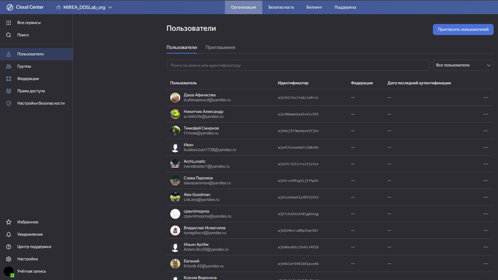
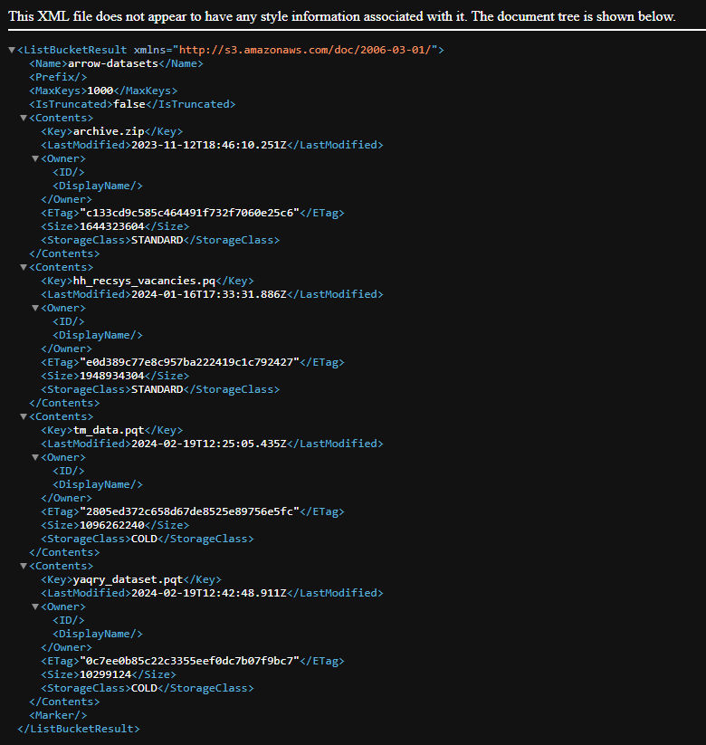
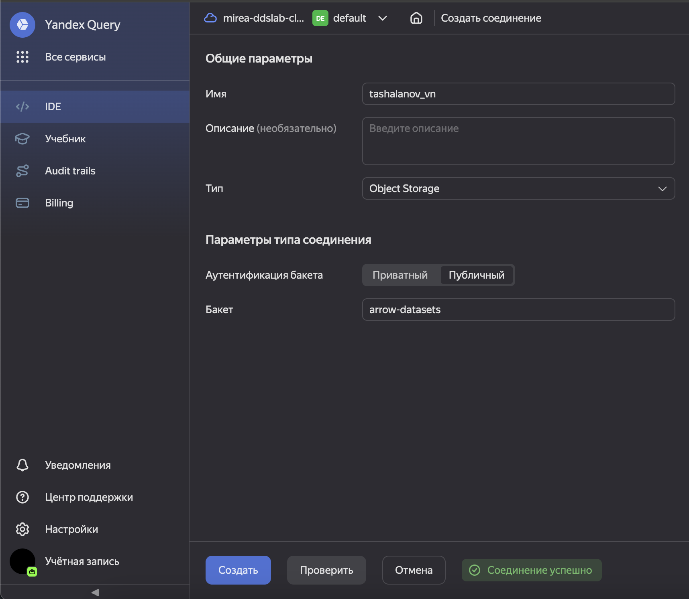
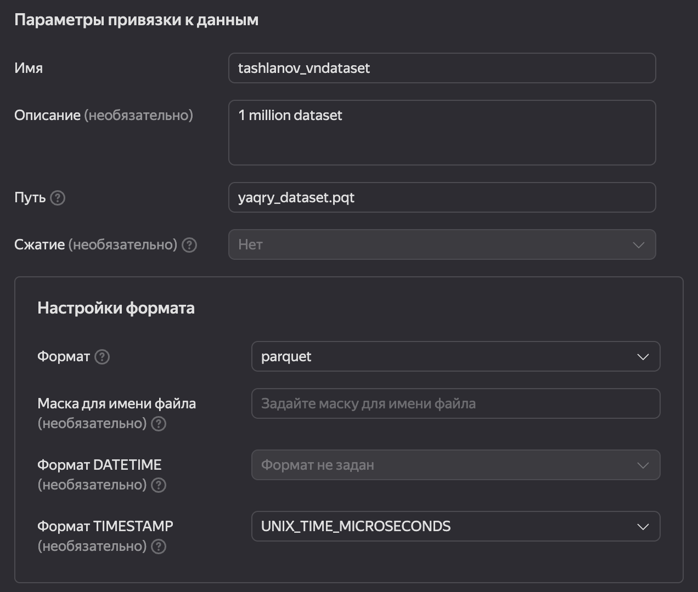
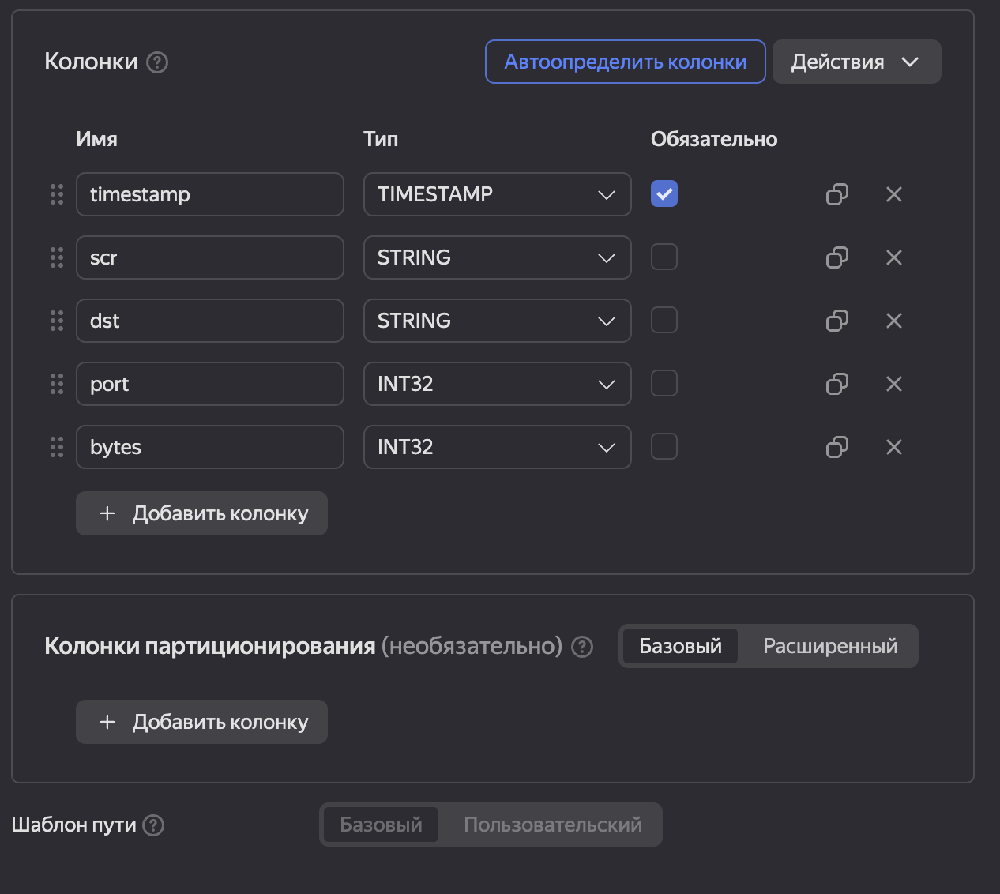
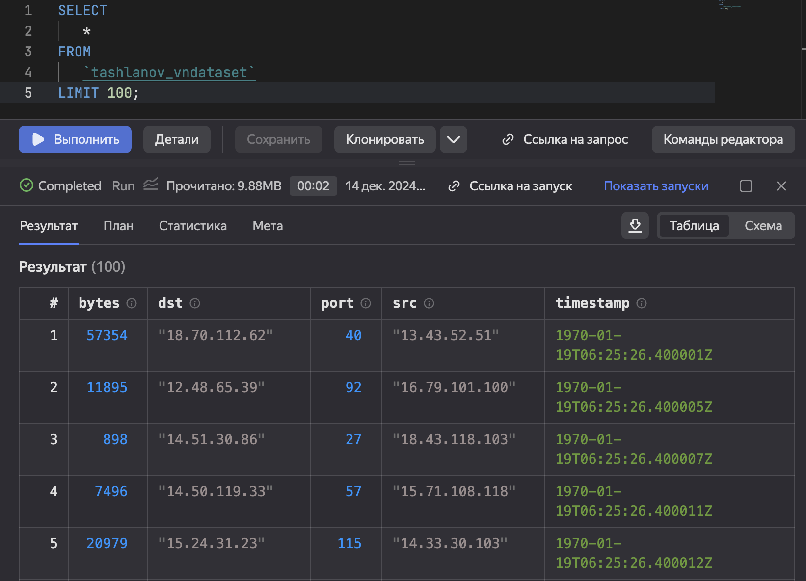
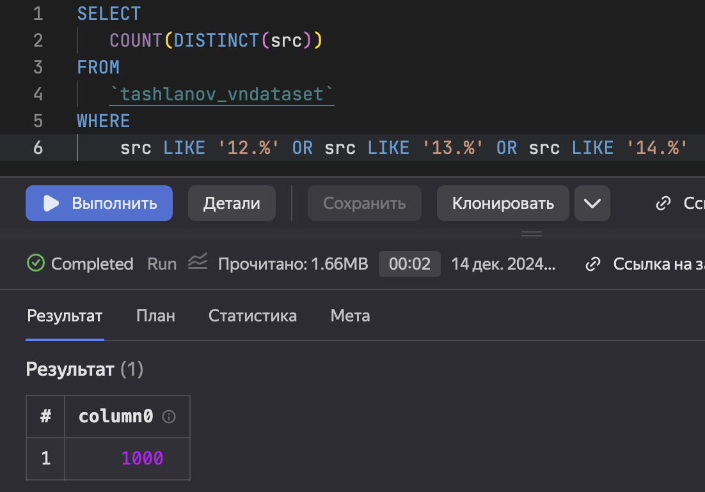
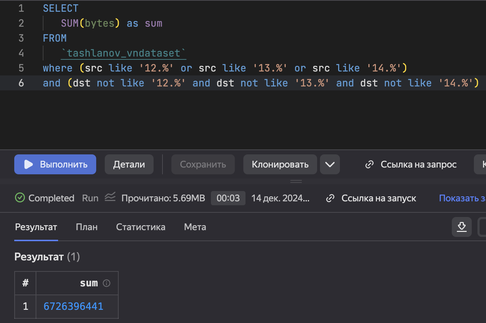
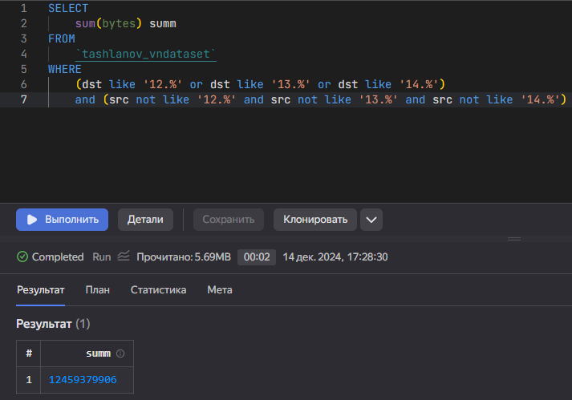

# Технология Yandex Query для анализа данных сетевой активности
## Цель работы

1. Изучить возможности технологии Yandex Query для анализа структурированных наборов данных
2. Получить навыки построения аналитического пайплайна для анализа данных с помощью сервисов Yandex Cloud
3. Закрепить практические навыки использования SQL для анализа данных сетевой активности в сегментированной корпоративной сети
## Исходные данные

1. Подсоединенный к Yandex Cloud Organization аккаунт
2. Бакет arrow-datasets
## План

1. Проверить доступность данных в бакете
2. Подключить бакет как источник данных
3. Решить задания
## Шаги

### 1. Присоединение к организации

### 2. Проверка доступности данных с помощью сконструированного URL

### 3. Подключаем бакет как источник данных для Yandex Query

Теперь, после создания соединения, укажем какой объект использовать в качестве источника данных. Для этого нужно сделать привязку данных.

### 4. Проверка датасета аналитическим запросом

## Анализ и выполнение заданий
### 1. Известно, что IP адреса внутренней сети начинаются с октетов, принадлежащих интервалу [12-14]. Определите количество хостов внутренней сети, представленных в датасете.

### 2. Определите суммарный объем исходящего трафика

### 3. Определите суммарный объем входящего трафика

## Оценка результата
Были развиты практические навыки использования технологии Yandex Query для анализа данных сетевой активности из датасета, получен опыт использования SQL на платформе Yandex.

## Вывод
Платформа Yandex Query является удобным интерактивным инструментом для анализа данных, который позволяет обрабатывать данные из различных хранилищ, используя SQL-запросы.