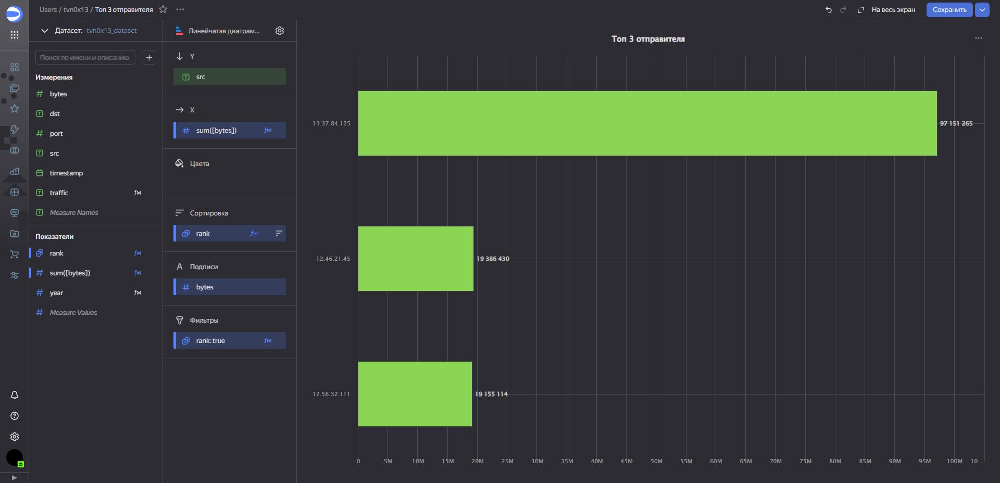
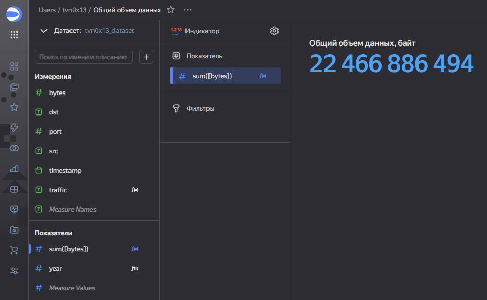

# Использование Yandex DataLens для анализа данных сетевой активности
## Цель работы
1. Изучить возможности технологии Yandex DataLens для визуального анализа структурированных наборов данных
2. Получить навыки визуализации данных для последующего анализа с помощью сервисов Yandex Cloud
3. Получить навыки создания решений мониторинга/SIEM на базе облачных продуктов и открытых программных решений
4. Закрепить практические навыки использования SQL для анализа данных сетевой активности в сегментированной корпоративной сети

## Исходные данные
1. Программное обеспечение Windows 10
2. Сервис Yandex DataLens

## План
3. Построить графики и индикаторы для анализа трафика.
4. Все построенные графики вывести в виде единого дашборда в Yandex DataLens.

## Шаги
### Настроить подключение к Yandex Query из DataLens

### Создать из запроса YandexQuery датасет DataLens

### Делаем нужные графики и диаграммы по заданию
1. Внутренний и внешний трафики - круговая диаграмма

2. Входящий и исходящий трафики - линейчатая диаграмма

3. Топ 3 отправителя - линейчатая диаграмма

4. Топ 3 получателя - линейчатая диаграмма

5. Распределение по портам - кольцевая диаграмма

6. Общий объем данных - индикатор

7. Максимальный объем данных за одну передачу - индикатор

8. Активность по времени - линейная диаграмма
К сожалению, у меня не получилось сделать этот виджет так, чтобы он корректно отображал дату. Возможно, проблема в микросекундах.

9. Средний объем данных - индикатор

10. Количество уникальных IP-адресов отправителей - индикатор

11. Актуальный год - индикатор
При добавлении новых данных в датасет, он будет полезен.

### Вывод чартов на дашборд
Ссылка на [дашборд](https://datalens.yandex.cloud/yk1k6iea1lcml-tashlanovdashboard).

## Оценка результата
В ходе работы были созданы чарты для анализа трафика, освоены инструменты для обработки и визуализации датасетов в виде удобных чартов и комплексных дашбордов.
## Вывод
Были получены знания об обработке датасетов на платформе YandexDataLens.